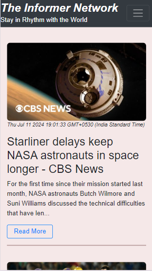

# **The Informer Network**

The Informer Network is a dynamic web application designed to keep users in rhythm with the latest news from around the world. Leveraging the power of the NewsAPI, this platform provides up-to-date headlines and articles across various categories, making it an essential tool for staying informed.

## **Features**

- **Top Headlines:** Get the latest top headlines from India, updated regularly to keep you informed about current events.
- **Search Functionality:** Easily search for news articles using keywords. The search results are displayed dynamically as you type.
- **Category Browsing:** Browse news articles by different categories like Finance, Politics, Entertainment, Sports, Crime, Business, Technology, Lifestyle, Health, and Education.
- **Hot Topics:** Quickly access news on trending topics with the "Hot Topics" dropdown menu.
- **Interactive UI:** An intuitive and responsive user interface built with Bootstrap 4, ensuring a seamless experience across different devices.
- **News Details:** Each news item includes an image, title, description, publication date, and a "Read More" link to the full article.

## **Preview**

### PC View


### Phone View


## **Technology Stack**

- **Frontend:** HTML, CSS, JavaScript, Bootstrap 4
- **Backend:** No backend as it uses NewsAPI for fetching news
- **API**: [NewsAPI](https://newsapi.org/)

## How to Use

### Prerequisites

1. **Get a NewsAPI Key:**
    - Go to [NewsAPI](https://newsapi.org/).
    - Sign up for an account if you don't have one.
    - After logging in, go to the [API key](https://newsapi.org/account) section.
    - Copy your API key.

### Setup

1. **Clone the repository:**
   
2. **Add your NewsAPI key:**
    - Open `script.js` in a text editor.
    - Replace `<ENTER YOUR API KEY>` with your actual NewsAPI key:
    ```javascript
    const apiKey = '<ENTER YOUR API KEY>';
    ```
3. **Open `index.html` in your preferred web browser:**
    - Open `index.html` in your code-editor (try using VS-code with extension live-server installed).
    -  Run (Go-live in VS-code) the html file to enjoy the latest news.

**Note : ** Don't run `index.html` directly from your file manager; go through the steps to properly enjoy lastest news.

## **Future Enhancements**

- **User Authentication:** Allow users to sign up and save their favorite articles.
- **Personalized News:** Offer personalized news feeds based on user preferences.
- **Real-time Updates:** Implement real-time news updates using WebSockets.


### Stay informed with The Informer Network!
